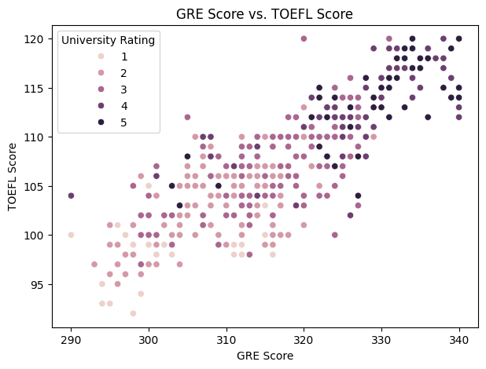
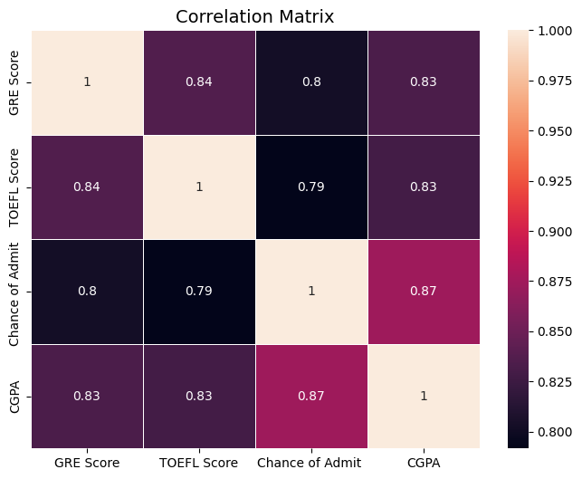
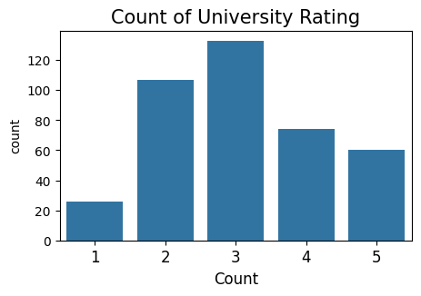
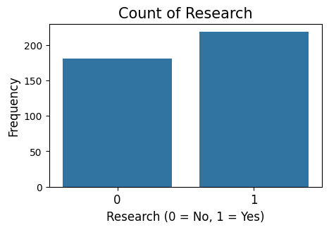
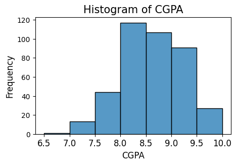
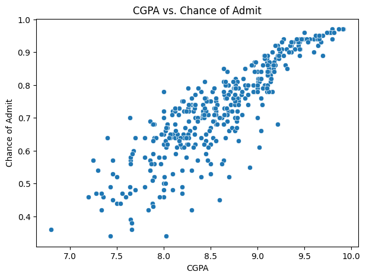
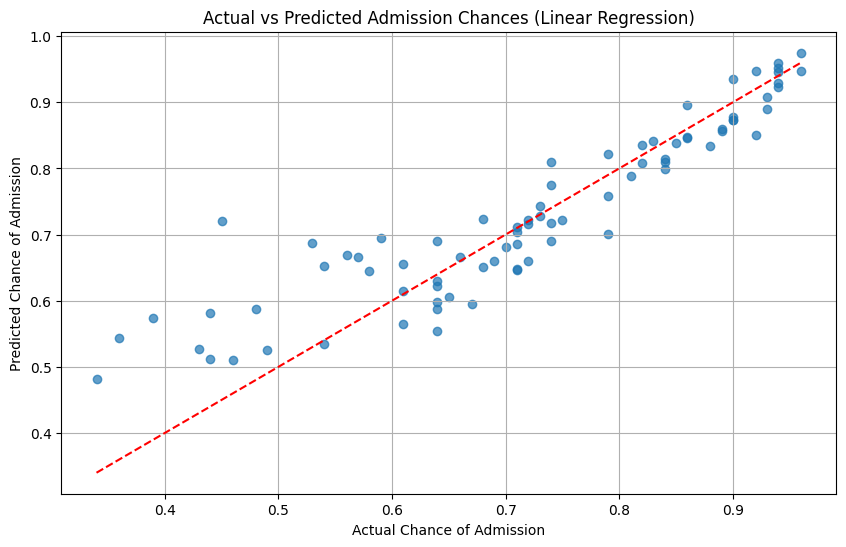

# Graduate University Admissions
## By Mita Crane, Safina Davis, Sneha Khatuwala, Mackenzie Steinbiss

This contains a summary of the Final Project for DS 201. For more in-depth in-sight, please check out our walkthrough video or run our notebook directly in Google Colab linked below.
---

## 📋 Table of Contents

1. [Business Understanding](#business-understanding) \
   a. [Business Objetives](#business-objectives) \
   b. [Data Science Goals](#data-science-goals) \
   c. [Project Plan](#project-plan) 
3. [Data Understanding](#data-understanding)  
4. [Visualizations](#visualizations)
5. [Conclusions & Future Directions](#conclusions--future-directions)  
6. [Resources](#resources) \
   a. [Google Colab](#google-colab) \
   b. [Youtube](#youtube-links) \
   c. [IO Page](#io-page)

---

## Business Understanding

### Business objectives
The objective is to understand and predict the factors that influence a student’s chance of admission to a university. This insight can help universities optimize admissions strategies and applicants better understand how their profiles affect admission outcomes. Specifically:
  a. Identify which variables (e.g., SAT, GPA, GRE, TOEFL, University rating) have the strongest impact.
  b. Predict a student's likelihood of admission based on their profile.

1. Assess the situation
  a. Resources: The dataset includes key academic metrics and admission outcomes
  b. Constraints:
      a. Limited number of features (might not capture other important factors like extracurriculars, essays).
      b. Possible missing values or biases (e.g., dataset might be skewed towards particular types of students or universities).

2. Risks:
   a. Misinterpretation: Correlation does not imply causation.
   b. Overfitting if models are too complex relative to dataset size.

3. Assumptions: Data is accurate and representative of a general applicant pool.

### Data science goals
1. Perform exploratory data analysis (EDA) to identify patterns, distributions, and relationships.

2. Build predictive models to estimate the probability of admission based on available features.

3. Evaluate model performance using appropriate metrics (e.g., RMSE for regression, R² score).

### Project plan
1. Data Understanding -
  a. Summarize and visualize the dataset.
  b. Check for missing values, outliers, and data types.

2. Data Preparation -
  a. Handle missing values if any.
  b. Normalize or standardize features if necessary.
  c. Create training and test datasets.

3. Modeling -
   a. Train different models (linear regression, decision trees, etc.).
   b. Tune hyperparameters for better performance.

4. Evaluation -
  a. Assess models using appropriate evaluation metrics.
  b. Compare model results to choose the best-performing one.

5. Deployment/Reporting -
  a. Present findings and interpretations.
  b. Share actionable insights (e.g., improving GPA or TOEFL might most strongly impact admission chances).

---

## Data Understanding

1. When was the data acquired?
We do not know the specific date of when the data was acquired but it was uploaded to Kaggle in 2021.

2. Where was the data acquired?
The team that performed the analysis in this report accessed the data used in the report via Kaggle.com. However, based on the description and typical context, it appears to be based on or inspired by the famous "Graduate Admissions" dataset from the University of California, Irvine (UCI) Machine Learning Repository. That original dataset contains similar attributes (GRE, TOEFL, SOP, LOR, CGPA, Research, Chance of Admit) and is often used for machine learning projects.

3. How was the data acquired?
The data was sourced from Kaggle for this project but there is no information in Kaggle as to how the data was originally collected.
Some potential sources could be -
  a. Public university admission records: Some universities publish anonymized admission statistics (scores, GPAs, etc.) online.
  b. Surveys: The creator could have surveyed students who recently applied to graduate schools and self-reported their scores and admission chances.
  c. Simulated data: Sometimes datasets are artificially created based on typical ranges and patterns seen in real admissions.
  d. Research studies: Academic papers sometimes collect and share admissions-related datasets for analysis.

4. What are the attributes of the dataset?
The variables and their descriptions are as follows -
GRE Scores ( out of 340 )
TOEFL Scores ( out of 120 )
University Rating ( out of 5 )
Statement of Purpose (SOP) and Letter of Recommendation (LOR) Strength ( out of 5 )
Undergraduate GPA ( out of 10 )
Research Experience ( either 0 or 1 )
Chance of Admit ( ranging from 0 to 1 )  

| Attribute | Description | Data type | Null values? |
| --- | --- | --- | --- |
| GRE Scores | Score on the GRE exam out of 340 | Ratio | No |
| TOEFL Scores | Score on the TOEFL exam out of 120 | Ratio | No |
| University Rating | A rating of the university out of 5 | Ordinal | No |
| Statement of purpose | Strength of the statement of purpose out of 5 | Ordinal | No |
| Letter of recommendation | Strength of the letter of recommendation out of 5 | Ordinal | No |
| Undergraduate GPA | Undergraduate GPA out of 10 | Ratio | No |
| Research experience | Research experience (0 = no, 1 = yes) | Nominal | No |
| Chance of admit | Chance of getting an admission (Ranging from 0 to 1) | Ratio | No |

---

## Visualizations
1. Scatterplot between GRE Score vs TOEFL Score based on university rating.
We hypothesize that higher the university rating, greater are the scores required on both the tests.

As we can see our hypothesis was correct: Higher the rating of the university, higher is the score required to get an admission into them.

2. Correlation heatmap to see how the variables are correlated to one another.

As you can see, almost all our variables have a correlation of around 0.80 or greater which goes to show that all are variables are highly positively correlated to one another. If the CGPA rises, scores on GRE and TOEFL also increase. 

3. Countplot of University Rating to see which rating has the highest frequency in our dataset

As you can see, the rating of 3 has the highest frequency so most of the universities in out dataset lie in the middle, neither too good nor too bad

4. Countplot of research - this is a simple graph just to see the frequency of having a research experience or no. We think that having the research experience would increase the chances of getting into a university.

5. Histogram on CGPA shows us the distribution of the undergraduate CGPA. As you can see that a greater number of applicants in the dataset lie within the 8.0 to 8.5 range.

6. Scatterplot between undergraduate CGPA vs the chance of admission into a graduate program. This is also important to look at as we would think that a higher CGPA in the undergraduate university would increase the chances of getting an admission into a graduate university.
   

---
## Conclusions & Future Directions
Using our Linear Regression Model we were able to fit a regression line in our scatterplot which was able to capture our data perfectly and give predicted calues close to the actual values. Below is the chart

The analysis revealed that certain features, notably CGPA and GRE scores, have a strong positive correlation with admission chances. The multiple linear regression model provided a clear understanding of these relationships, while ensemble methods like random forests offered improved predictive accuracy by capturing complex interactions between variables.

Key findings include:
   a. CGPA: A higher undergraduate GPA consistently increases the likelihood of admission.
   b. GRE Scores: Strong GRE scores positively influence admission chances, though their impact varies across different university ratings.
   c. Research Experience: Applicants with research experience have a higher probability of admission, highlighting the value placed on research exposure.

These insights align with existing literature emphasizing the importance of academic performance and research experience in graduate admissions.
To build upon this study, future research could consider:
1. Incorporating Non-Academic Factors: Include qualitative data such as personal statements, letters of recommendation, and extracurricular activities to capture a holistic view of the applicant.
2. Advanced Modeling Techniques: Utilize deep learning models or natural language processing (NLP) to analyze textual data from essays and recommendations, as explored in recent studies .
3. Bias and Fairness Analysis: Investigate potential biases in the models concerning gender, race, or socioeconomic status, ensuring equitable admission predictions .
4. Longitudinal Studies: Track admitted students' performance over time to validate the predictive models and adjust them based on real-world outcomes.

By addressing these areas, future models can provide more comprehensive and fair assessments, aiding both institutions and applicants in the admissions process.

---

## Resources

### Google Colab
To view our code in google colab, use this link - 
[Click Here!](https://colab.research.google.com/drive/1MVTng6DKpBt4lx7TXojKAautEbRBaRaz#scrollTo=jpX5BQm1ZEm6)

### Youtube Links
To watch our tutorials on Youtube, use the links below \
1. [Tutorial Video](https://www.youtube.com/watch?v=RESPZUGnSgU)
2. [Presentation Video](https://www.youtube.com/watch?v=JGH4WWXevRc)

### IO Page
Use the link below for our io page 

---

